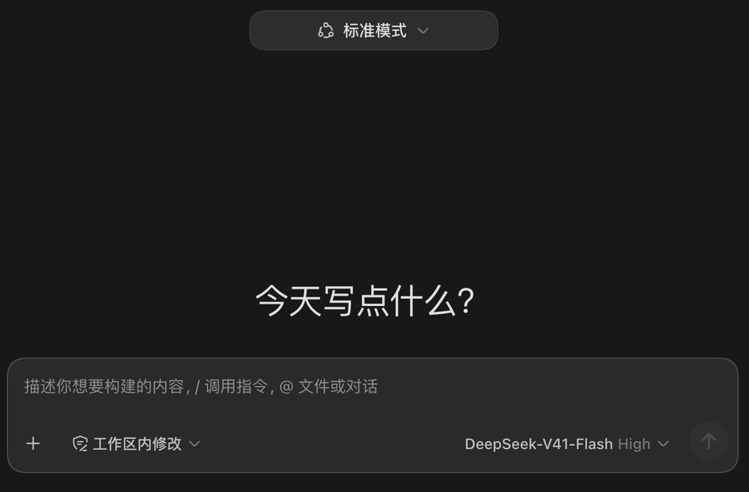

# dsh-codex-theme

把 [DeepSeek Harness](https://github.com/deepseek-ai/deepseek-harness) 的 Web UI 换装成 Codex 桌面端外观的一组 DSH 插件。



> **试验性项目**：本仓库是对 DSH 官方产物（CSS module 哈希类名 + 私有 loader 协议）的逆向覆盖层，上游版本更新后部分规则可能失效。仅供个人试验使用，不承诺跟随上游维护。

## 你能得到什么

- **逐像素取样的色板** — 60+ 设计令牌（背景 / 文字 / 边框 / 按钮 / 菜单…）全部从真实 Codex 桌面端截图采样，侧栏比主区亮一档、纯中性无蓝移，与 Codex 一致
- **Codex 式侧栏** — 30pt 发丝行高、18px 品牌字、右对齐的搜索槽、无框「新会话」行、分组操作按钮仅在悬停时浮现；折叠后侧栏整体隐藏，仅保留标题栏内的开关
- **composer 卡片** — 20pt 圆角、`#2a2a2a`、聚焦时边框提亮，工具行贴底
- **菜单动效** — 菜单/子菜单展开带 `pop` 动画、空态标题上浮、发送按钮按压回弹；尊重系统「减弱动态效果」
- **侧栏「插件」行** — 注册在壳层的 `sidebar.panellist`（新会话正下方，即 ChatGPT 里 Scheduled / Plugins 的位置）。点击后直达设置的「插件」分区：设置面板的分区状态为组件私有 state，无对外 API，因此在捕获阶段拦截该行的点击事件并代为导航。图标大小、缩进、亮度与新会话行逐像素一致（壳层默认把未选中面板图标压暗到 0.7，已覆盖为不透明）
- **轮换标语** — 空态大标题的固定文案换成六句轮换（「今天我们要构建什么？」…），每回到空态换一句，「预览版」徽章不受影响。标语列表位于 `sidebar-plugins/lib/client.js` 的 `TAGLINES` 数组，可自行增删
- **CSS 热更新** — 样式表在每次渲染时从磁盘重读并内联进 `<head>`：改完 ⌘R 就生效，不存在样式请求失败或缓存陈旧的问题

以上全部只是显示层：**不改变任何发给模型的内容，也不碰工具执行逻辑**。

## 安装

两个插件：`codex-theme/`（宿主侧，注入 CSS）和 `sidebar-plugins/`（客户端，侧栏行 + 标语）。零构建，没有 TS 没有打包器。

```bash
git clone https://github.com/Shiorangerin/dsh-codex-theme.git
# 然后按下文注册两个插件
```

### 或者直接把这段复制给你的 AI 助手

```text
请帮我安装 dsh-codex-theme（DeepSeek Harness 的 Codex 风格主题）：
1. git clone https://github.com/Shiorangerin/dsh-codex-theme.git 到任意目录，记为 $THEME_DIR
2. 在 DeepSeek Harness 官方仓库根目录执行：
   node apps/cli/lib/bin.js plugin --profile web add file:$THEME_DIR/sidebar-plugins
3. 编辑 ~/.dsh/profiles/web/cordis.patch.yml（没有就新建），确保包含：
   - insert:
       - id: codex-theme
         name: '$THEME_DIR/codex-theme/plugin.js'
       - id: codex-sidebar
         name: 'dsh-codex-sidebar'
   注意：第一条（宿主插件）用绝对路径；第二条必须是裸包名 dsh-codex-sidebar，
   客户端包的浏览器半只按包名解析，写绝对路径不会被识别。
4. 重启 DSH 的 web 服务并刷新页面。
```

### 可选：顶部模式控件

在 `~/.dsh/settings.yaml` 里加上 `agent-presets: { modeSelectionEnabled: true }`，DSH 的 agent preset 座位会移到主列顶部（Codex 的 Chat | Work 分段控件位置）。

### 可选：折叠侧栏零宽

主题默认折叠后侧栏完全消失，这依赖官方源码布局常量的两行改动（不改则折叠为 56px 图标栏，其余不受影响）：

```diff
-SIDEBAR_AUTO_COLLAPSE = 1024
+SIDEBAR_AUTO_COLLAPSE = 880
-SIDEBAR_COLLAPSED = 56
+SIDEBAR_COLLAPSED = 0
```

（在 `packages/client` 里 `rg "SIDEBAR_COLLAPSED = "` 定位文件。）

## 说明

- 类名匹配只做整 token 匹配（`[class$='_x']` / `[class*='_x ']` / `[class*='_x_']` 三种形态），因为 DSH 的类名是 CSS module 哈希：子串匹配会误伤邻居（`_card` vs `_cardWorkspaceTrigger`），整哈希又活不过一次重构建
- 客户端半是手写的 `window.__ModuleLoader__.load` bundle，与官方客户端包同格式；元素必须走 `react/jsx-runtime` 创建，裸 `{type, props}` 会被 React 拒绝（error #31）
- `dsh plugin add file:...` 为复制安装而非软链接：修改 `sidebar-plugins/lib/client.js` 必须重跑安装命令
- 「插件」行跳转依赖设置导航文案为「插件」（简体中文界面），其他语言改 `lib/client.js` 顶部的 `SECTION_LABEL`

## 故障排查

- **整站报 "Failed to load plugins"** — 通常是手写 bundle 语法错误，或 `cordis.patch.yml` 里客户端包没按裸包名写。开浏览器控制台看报错。
- **改了 client.js 没反应** — 两步都要做：重跑 `dsh plugin add file:...`（复制机制）+ 强刷（客户端 bundle 带 `immutable` 缓存头）。
- **上游更新后样式部分失效** — 属预期：类名发生漂移。对着新产物的 CSS module 重新核对失效规则的选择器即可，规则本体通常仍然有效。
- **折叠后侧栏还在** — 见上方「可选：折叠侧栏零宽」的源码补丁。

## 许可证

MIT
